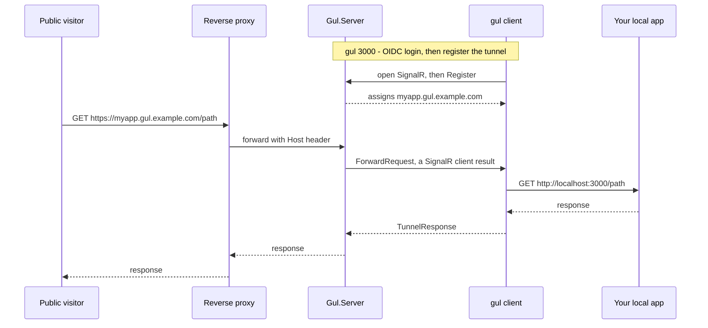

<p align="center">
  
</p>
<p align="center">
  <strong>Gul</strong> <sub>(굴, Korean for tunnel/burrow/cave)</sub><br/>
  One command. Your whole local stack, live on one public URL.
</p>
<p align="center">
  <a href="https://github.com/PianoNic/Gul"></a>
  <a href="https://docs.gul.pianonic.ch/self-host"></a>
  
  
</p>

---

> **Heads up:** Gul is in early development. Expect rough edges and breaking changes between versions.

## What is Gul?

Gul is a self-hosted devtunnel, an ngrok you host yourself, with one big difference. It puts your **whole local stack** on **one public URL**, not just one port. Run `gul 3000` and a public HTTPS URL like `https://happy-otter.gul.example.com` forwards straight to your machine, with no inbound firewall holes and no port forwarding. You run the server, so you own the domain and the data.

## Why Gul?

Other tunnels (ngrok, cloudflared, localtunnel) expose a single port. The moment a remote visitor loads your app, every cross-service link, CORS call, and OIDC login breaks. Gul fixes all three automatically.

| Differentiator | What Gul does |
|---|---|
| **Auto-router translator** (the flagship) | One tunnel exposes your entire multi-service dev setup. Gul rewrites cross-service local URLs (a frontend on `:3000` calling `http://localhost:8000`) into gul routes on the fly and routes them back to the right port. Your whole stack works through one URL with zero code changes. **No other local tunnel does this.** |
| **CORS just works** | Services now sit on different gul origins, so browsers would normally block cross-service calls. Gul does bidirectional origin translation, rewriting `Origin` and `Referer` inbound to the local origin and `Access-Control-Allow-Origin` outbound to the gul origin, so the calls just succeed. |
| **OIDC just works** | Apps behind a self-hosted OIDC provider (Keycloak, Authentik, Zitadel, Pocket ID, Dex, and any standard OAuth2/OIDC server) log in straight through the tunnel with zero provider config. Gul rewrites `redirect_uri` and `post_logout_redirect_uri` inbound to the localhost callback the provider already allows, and the callback lands back in the tunnel via the `Location` rewrite. Cloud providers (Auth0, Okta, Google, Entra, Cognito) just need the gul public URL whitelisted once (use a stable `--name`). |

### The translator, before and after

**Before.** Your frontend on `:3000` ships HTML and JS that call `http://localhost:8000` for the API. Through an ordinary tunnel the remote visitor's browser tries to reach *their own* localhost, and the API call dies on the spot.

**After.** Gul spots `http://localhost:8000` in the response and turns it into `http://<id>.<yoursub>.localhost:5080` before the bytes ever leave your machine. The visitor's browser follows that route back through the same tunnel to your local `:8000`. Frontend, API, auth, and everything else just work through one public URL.

By default Gul translates everything, every absolute `http(s)` URL it finds, loopback hosts and external hosts alike. Want a tighter net? Restrict it to loopback-only or to an explicit allowlist with the `Translate` config value or the `--translate` flag. Rewriting covers text response bodies (HTML, CSS, JS, JSON, and the like) and the `Location` redirect header, and it all happens client-side, on your machine. Full details on the [Auto-router translator](https://docs.gul.pianonic.ch/translator) page.

## Solid foundations

- **Self-hosted.** You run the server, you own the domain and the data.
- **OIDC-guarded control plane.** Only you can open tunnels (browser login, Authorization Code + PKCE). Public visitors to your tunnel stay anonymous.
- **One small binary.** A single self-contained CLI, built for 6 targets (Windows, Linux, and macOS on x64 and arm64), installable with one line.
- **Friendly CLI.** Colored output and a 굴 badge. Random friendly subdomains, or claim your own with `--name`.
- **.NET 10 ASP.NET Core + SignalR** under the hood. No database, no frontend, KISS.

## How it works



1. Run `gul 3000`. The CLI signs you in via OIDC, opens a SignalR connection to `Gul.Server`, and is assigned a subdomain (a random friendly name, or `--name yours`).
2. A visitor hits `https://<sub>.gul.example.com`. Your wildcard reverse proxy forwards it to `Gul.Server`.
3. `Gul.Server` reads the `Host` header, finds the connection that owns `<sub>`, and invokes `ForwardRequest` on that client (a SignalR **client result**), awaiting the response.
4. The client re-issues the request to `http://localhost:3000` and streams the response back over the connection. The server writes it to the original visitor.

## Features

- **Auto-router translator.** Your whole multi-service stack on one URL. Gul rewrites cross-service links in your app's responses (and the `Location` redirect header) into gul routes that forward back to the right local port, so your frontend, API, and auth all work through a single tunnel with zero code changes. Translate everything by default, or narrow it to loopback-only or an allowlist with `--translate`. No other local tunnel does this.
- **CORS just works.** Bidirectional origin translation rewrites `Origin` and `Referer` inbound to the local origin and `Access-Control-Allow-Origin` outbound to the gul origin, so cross-service browser calls succeed instead of getting blocked.
- **OIDC just works.** Apps behind a self-hosted OIDC provider log in straight through the tunnel with zero provider config, because Gul rewrites `redirect_uri` and `post_logout_redirect_uri` to the callback the provider already allows. Cloud providers just need the gul public URL whitelisted once.
- **One command.** `gul 3000` and your local port is live at a public HTTPS URL.
- **Random or named subdomains.** A friendly name like `happy-otter` by default, or claim your own with `--name myapp`.
- **OIDC-guarded control plane.** Only you can open tunnels. A browser login (Authorization Code + PKCE) guards the control connection, and visitors to your tunnel stay anonymous.
- **One small binary.** A self-contained single-file CLI, built for 6 targets (Windows, Linux, and macOS on x64 and arm64). No agent, no daemon, no database.
- **Behind your own proxy.** Gul rides on an existing wildcard reverse proxy that already terminates TLS for `*.gul.example.com`.

## Install

One line downloads the right binary for your OS/arch and puts `gul` on your `PATH`:

```sh
curl -fsSL https://raw.githubusercontent.com/PianoNic/Gul/main/install.sh | sh   # macOS / Linux
```
```powershell
irm https://raw.githubusercontent.com/PianoNic/Gul/main/install.ps1 | iex        # Windows
```

**Portable.** Grab the standalone single-file binary for your platform (`gul-win-x64.exe`, `gul-linux-arm64`, `gul-osx-arm64`, …) from the [latest release](https://github.com/PianoNic/Gul/releases/latest), drop it on your `PATH`, and run `gul`.

## Get started

- 📦 **[Self-host guide](https://docs.gul.pianonic.ch/self-host)**. Run the server image with `docker compose` behind your wildcard reverse proxy.
- 🛠️ **[CLI usage](https://docs.gul.pianonic.ch/cli)**. Install `gul`, then `gul remote`, `gul login`, `gul <port>`.
- ✨ **[Auto-router translator](https://docs.gul.pianonic.ch/translator)**. Run a whole multi-service dev setup through one tunnel.
- 🧑‍💻 **[Developer setup](https://docs.gul.pianonic.ch/dev-setup)**. `dotnet run` the server and client locally. Includes [testing `gul login` locally](https://docs.gul.pianonic.ch/dev-setup#test-login-locally) against a Dockerized mock OIDC provider.

Full documentation: **[docs.gul.pianonic.ch](https://docs.gul.pianonic.ch)**

<details>
<summary><strong>Tech stack</strong></summary>

- **.NET 10** ASP.NET Core server. A SignalR hub plus a host-header forwarding middleware, with an in-memory tunnel registry (no database, no frontend, KISS).
- **.NET 10** self-contained console CLI (`Microsoft.AspNetCore.SignalR.Client`), built for 6 targets (`gul-win-x64`, `gul-linux-x64`, `gul-linux-arm64`, `gul-osx-x64`, `gul-osx-arm64`, and Windows arm64) as one single-file binary each.
- **SignalR client results** carry each public HTTP request down to the client and the response back.
- **Client-side URL translation** turns cross-service references into gul routes on the fly, so an entire local stack rides one tunnel. Other tunnels expose one port and break every cross-service link. Gul does not.
- **Bidirectional origin translation** rewrites `Origin` and `Referer` inbound and `Access-Control-Allow-Origin` outbound, so cross-origin browser calls between gul-hosted services pass CORS.
- **OIDC.** Authorization Code + PKCE with a loopback redirect on the client, and JwtBearer validation on the server. Inbound `redirect_uri` and `post_logout_redirect_uri` rewriting lets apps behind self-hosted providers log in through the tunnel with no provider config.
- **Scalar** + OpenAPI in development.

</details>

## License

TBD.

---

<p align="center">Made with care by <a href="https://github.com/PianoNic">PianoNic</a></p>
