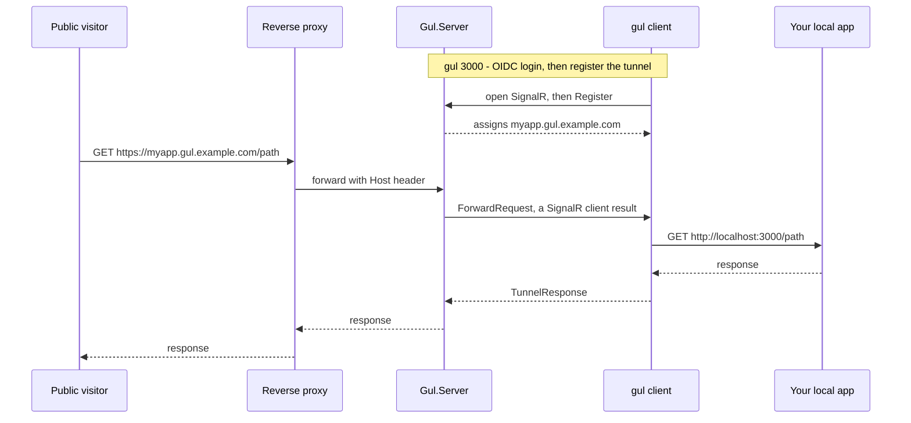

<p align="center">
  
</p>
<p align="center">
  <strong>Gul</strong> <sub>(굴 — Korean for tunnel/burrow/cave)</sub><br/>
  One command. Your localhost, live on the internet.
</p>
<p align="center">
  <a href="https://github.com/PianoNic/Gul"></a>
  <a href="https://docs.gul.pianonic.ch/self-host"></a>
  
  
</p>

---

> **Heads up:** Gul is in early development. Expect rough edges and breaking changes between versions.

## What is Gul?

Gul is a tiny, self-hosted devtunnel — an ngrok you host yourself. Run one command, `gul 3000`, and a public HTTPS URL like `https://happy-otter.gul.example.com` forwards straight to a server running on your machine. Pick a random subdomain or claim your own, sign in through your OIDC provider, and you're live — no inbound firewall holes, no port forwarding.

## How it works



1. Run `gul 3000`. The CLI signs you in via OIDC, opens a SignalR connection to `Gul.Server`, and is assigned a subdomain (a random friendly name, or `--name yours`).
2. A visitor hits `https://<sub>.gul.example.com`. Your wildcard reverse proxy forwards it to `Gul.Server`.
3. `Gul.Server` reads the `Host` header, finds the connection that owns `<sub>`, and invokes `ForwardRequest` on that client (a SignalR **client result**), awaiting the response.
4. The client re-issues the request to `http://localhost:3000` and streams the response back over the connection. The server writes it to the original visitor.

## Features

- **One command.** `gul 3000` and your local port is live at a public HTTPS URL.
- **Random or named subdomains.** A friendly name like `happy-otter` by default, or claim your own with `--name myapp`.
- **OIDC-protected control plane.** Only you can open tunnels — a browser login (Authorization Code + PKCE) guards the control connection. Visitors to your tunnel stay anonymous.
- **One small binary.** A self-contained single-file CLI per OS. No agent, no daemon, no database.
- **Behind your own proxy.** Gul rides on an existing wildcard reverse proxy that already terminates TLS for `*.gul.example.com`.

## Install

One line — downloads the right binary for your OS/arch and puts `gul` on your `PATH`:

```sh
curl -fsSL https://raw.githubusercontent.com/PianoNic/Gul/main/install.sh | sh   # macOS / Linux
```
```powershell
irm https://raw.githubusercontent.com/PianoNic/Gul/main/install.ps1 | iex        # Windows
```

**Portable** — grab the standalone single-file binary for your platform (`gul-win-x64.exe`, `gul-linux-arm64`, `gul-osx-arm64`, …) from the [latest release](https://github.com/PianoNic/Gul/releases/latest), drop it on your `PATH`, and run `gul`.

## Get started

- 📦 **[Self-host guide](https://docs.gul.pianonic.ch/self-host)** — run the server image with `docker compose` behind your wildcard reverse proxy.
- 🛠️ **[CLI usage](https://docs.gul.pianonic.ch/cli)** — install `gul`, then `gul remote`, `gul login`, `gul <port>`.
- 🧑‍💻 **[Developer setup](https://docs.gul.pianonic.ch/dev-setup)** — `dotnet run` the server and client locally. Includes [testing `gul login` locally](https://docs.gul.pianonic.ch/dev-setup#test-login-locally) against a Dockerized mock OIDC provider.

Full documentation: **[docs.gul.pianonic.ch](https://docs.gul.pianonic.ch)**

<details>
<summary><strong>Tech stack</strong></summary>

- **.NET 10** ASP.NET Core server — a SignalR hub plus a host-header forwarding middleware, with an in-memory tunnel registry (no database, no frontend).
- **.NET 10** self-contained console CLI (`Microsoft.AspNetCore.SignalR.Client`), shipped as one binary per OS.
- **SignalR client results** carry each public HTTP request down to the client and the response back.
- **OIDC** — Authorization Code + PKCE with a loopback redirect on the client; JwtBearer validation on the server.
- **Scalar** + OpenAPI in development.

</details>

## License

TBD.

---

<p align="center">Made with care by <a href="https://github.com/PianoNic">PianoNic</a></p>
