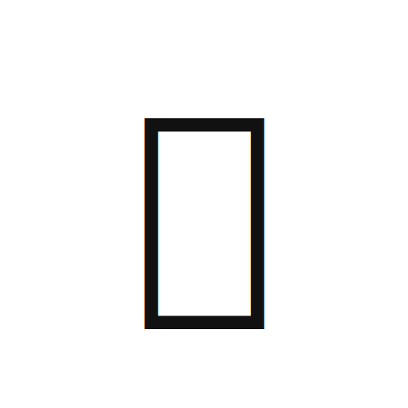
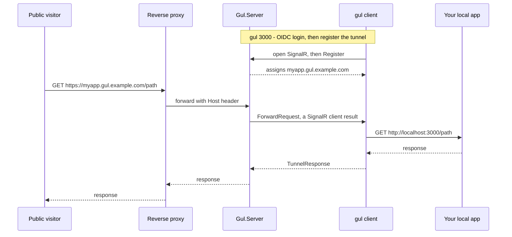

<p align="center">
  
</p>
<p align="center">
  <strong>Gul</strong> <sub>(굴, Korean for tunnel/burrow/cave)</sub><br/>
  One command. Your whole local stack, live on one public URL.
</p>
<p align="center">
  <a href="https://github.com/PianoNic/Gul"></a>
  <a href="https://docs.gul.pianonic.ch/self-host"></a>
  
  
</p>

---

> **Heads up:** Gul is in early development. Expect rough edges and breaking changes between versions.

## What is Gul?

Gul is a self-hosted devtunnel, an ngrok you host yourself, with one difference: it puts your **whole local stack** on **one public URL**, not just one port. Run `gul 3000` and `https://happy-otter.gul.example.com` forwards straight to your machine. You run the server, so you own the domain and the data.

## How it works



## Features

- **Auto-router translator** (flagship): rewrites cross-service local URLs (a frontend calling `http://localhost:8000`) into gul routes on the fly, so your whole multi-service stack works through one URL with zero code changes. No other local tunnel does this.
- **CORS just works**: bidirectional origin translation rewrites `Origin`, `Referer`, and `Access-Control-Allow-Origin`, so cross-service browser calls are not blocked.
- **OIDC**: add your gul URL as a callback in your provider and log in through the tunnel. A provider on `localhost` needs nothing.
- **One command**: `gul 3000` and your local port is live at a public HTTPS URL.
- **Self-hosted**: you own the server, domain, and data. Only you can open tunnels via browser login (Authorization Code + PKCE), and visitors stay anonymous.
- **One small binary**: a self-contained CLI for 6 targets (Windows, Linux, macOS on x64 and arm64), installable with one line.
- **Named subdomains**: a friendly name like `happy-otter`, or claim your own with `--name`.

## Install

```sh
curl -fsSL https://raw.githubusercontent.com/PianoNic/Gul/main/install.sh | sh   # macOS / Linux
```
```powershell
irm https://raw.githubusercontent.com/PianoNic/Gul/main/install.ps1 | iex        # Windows
```

Or grab a standalone binary (`gul-win-x64.exe`, `gul-linux-arm64`, `gul-osx-arm64`, …) from the [latest release](https://github.com/PianoNic/Gul/releases/latest).

## Get started

- 📦 **[Self-host guide](https://docs.gul.pianonic.ch/self-host)**. Run the server image with `docker compose` behind your wildcard reverse proxy.
- 🛠️ **[CLI usage](https://docs.gul.pianonic.ch/cli)**. `gul remote`, `gul login`, `gul <port>`.
- ✨ **[Auto-router translator](https://docs.gul.pianonic.ch/translator)**. Run a whole multi-service dev setup through one tunnel.
- 🔑 **[OIDC providers](https://docs.gul.pianonic.ch/oidc)**. Add your gul URL as a callback and log in through the tunnel.

Full documentation: **[docs.gul.pianonic.ch](https://docs.gul.pianonic.ch)**

<details>
<summary><strong>Tech stack</strong></summary>

- **.NET 10** ASP.NET Core server: a SignalR hub plus a host-header forwarding middleware and an in-memory tunnel registry. No database, no frontend.
- **.NET 10** self-contained console CLI (`Microsoft.AspNetCore.SignalR.Client`), one single-file binary per target.
- **SignalR client results** carry each public request down to the client and the response back.
- **Client-side URL translation** turns cross-service references into gul routes, so a whole local stack rides one tunnel.
- **OIDC**: Authorization Code + PKCE on the client, JwtBearer validation on the server.

</details>

## License

TBD.

---

<p align="center">Made with care by <a href="https://github.com/PianoNic">PianoNic</a></p>
